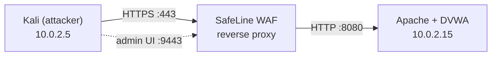

# Build Guide: WAF Home Lab with SafeLine

This is how I built my WAF home lab, from two empty VMs to a vulnerable app protected by SafeLine and tested with real attacks. I wrote it as I went, with the commands and screenshots, so anyone who wants a similar lab can follow the same path.

DVWA is intentionally vulnerable, which is why I ran everything on an isolated VirtualBox NAT Network and never exposed it to the internet.

## Overview



SafeLine and DVWA run on the same Ubuntu VM. SafeLine listens on 80/443 and forwards clean traffic to Apache on 8080, so every request from Kali passes through the WAF first.

| Component | Details |
|---|---|
| Hypervisor | Oracle VirtualBox |
| Attacker VM | Kali Linux, `10.0.2.5` |
| Target VM | Ubuntu Server 22.04 LTS, `10.0.2.15` |
| Web stack | Apache2, PHP 8.1, MySQL 8.0 |
| Vulnerable app | DVWA |
| WAF | SafeLine v9.3.6 (Docker) |
| Networking | VirtualBox NAT Network, `10.0.2.0/24` |
| TLS | Self-signed certificate for `dvwa.local` |

SafeLine runs several Docker containers, so the Ubuntu VM needs a fair amount of RAM, and both VMs need internet access for the installs.

## 1. Network

I attached both VMs to a **NAT Network** instead of Bridged. They can reach each other and the internet, but the vulnerable app stays off my home network. After checking the IPs with `ifconfig`, I pinged Ubuntu from Kali:

```bash
ping 10.0.2.15
```


Replies came back in 1-3 ms, so the routing worked.

## 2. Web stack on Ubuntu

I updated the server and installed the LAMP stack with the tools I needed:

```bash
sudo apt-get update && sudo apt-get upgrade -y
sudo apt-get install -y net-tools openssl apache2 php php-mysql mysql-server git
sudo mysql_secure_installation
```

In the secure installation script I removed anonymous users, disallowed remote root login, and dropped the test database.

Opening `http://10.0.2.15` from Kali showed the Apache default page, which confirmed both the web server and the network path.


## 3. DVWA

I cloned DVWA into Apache's web root and fixed ownership and permissions:

```bash
cd /var/www/html
sudo git clone https://github.com/digininja/DVWA.git
sudo chown -R www-data:www-data DVWA
sudo chmod -R 755 DVWA
sudo cp DVWA/config/config.inc.php.dist DVWA/config/config.inc.php
```

Then I created a dedicated database and user:

```sql
-- sudo mysql -u root
CREATE DATABASE dvwa;
CREATE USER 'dvwa_user'@'localhost' IDENTIFIED BY 'p@ssw0rd';
GRANT ALL ON dvwa.* TO 'dvwa_user'@'localhost';
FLUSH PRIVILEGES;
```

and pointed `DVWA/config/config.inc.php` at it:

```php
$_DVWA['db_database'] = 'dvwa';
$_DVWA['db_user']     = 'dvwa_user';
$_DVWA['db_password'] = 'p@ssw0rd';
```

I also added a small table of fake users to give the SQL injection test something to return:

```sql
USE dvwa;
CREATE TABLE test_users (
    id INT NOT NULL AUTO_INCREMENT,
    username VARCHAR(50) NOT NULL,
    password VARCHAR(50) NOT NULL,
    PRIMARY KEY (id)
);
INSERT INTO test_users (username, password) VALUES
    ('alice', 'alice123'), ('bob', 'bob123'), ('admin', 'admin123');
```

## 4. Moving Apache to port 8080

SafeLine needs ports 80 and 443, so Apache had to move out of the way. That took two edits:

- `/etc/apache2/ports.conf`: `Listen 80` became `Listen 8080`
- `/etc/apache2/sites-available/000-default.conf`: `<VirtualHost *:80>` became `<VirtualHost *:8080>`

```bash
sudo systemctl restart apache2
```

From Kali, `http://10.0.2.15:8080/DVWA/setup.php` loaded the DVWA setup page, and I clicked **Create / Reset Database** to initialise it.


## 5. Hostname

So I could use `dvwa.local` instead of the IP, I added this line to `/etc/hosts` on **both** VMs:

```text
10.0.2.15    dvwa.local www.dvwa.local
```

`ping dvwa.local` from Kali resolved to `10.0.2.15`.

## 6. Self-signed certificate

SafeLine needs a certificate to serve HTTPS for the app, so I generated one on Ubuntu with `dvwa.local` as the Common Name:

```bash
sudo mkdir /etc/ssl/dvwa
sudo openssl req -x509 -nodes -days 365 -newkey rsa:2048 \
  -keyout /etc/ssl/dvwa/dvwa.key \
  -out /etc/ssl/dvwa/dvwa.crt
```

## 7. Installing SafeLine

```bash
sudo bash -c "$(curl -fsSLk https://waf.chaitin.com/release/latest/manager.sh)" -- --en
```

I chose **1. Install**, let it install Docker, and kept the default path. When it finished it printed the admin URL (`https://10.0.2.15:9443`) and a generated admin password.


The installer sets up an Nginx-based reverse proxy in Docker, opens 9443 for the admin UI, and listens on 80/443 for application traffic.

I logged in from Kali and accepted the self-signed certificate warning:


## 8. Adding the certificate and the application

**Certificate.** In *Settings → Certificates* I added a new one and pasted in the contents of `dvwa.crt` and `dvwa.key`, which I read with `sudo cat`.

**Application.** Under *Applications → Add Application* I used:

| Field | Value |
|---|---|
| Domain | `dvwa.local`, `www.dvwa.local` |
| Port | `443`, HTTPS |
| SSL cert | the certificate I just added |
| Mode | Reverse Proxy |
| Upstream | `http://10.0.2.15:8080` |
| Name | DVWA |


After that, `https://dvwa.local/DVWA` from Kali went through the WAF. I logged in to DVWA (`admin` / `password`) and set **DVWA Security** to **Low** so the vulnerabilities were exploitable.


## 9. Attacks and results

All tests ran from Kali against `https://dvwa.local/DVWA`.

| Test | Payload / method | Result |
|---|---|---|
| SQL injection | `1' OR '1'='1` | Blocked |
| Reflected XSS | `<script>alert('XSS')</script>` | Blocked |
| Command injection | `; ls -la /etc` | Detected and logged, not blocked |
| HTTP flood | 200 rapid `curl` requests | Rate limit triggered, Anti-Bot challenge served |
| IP deny rule | Deny source IP `10.0.2.5` | Access Forbidden |
| Auth gateway | SafeLine SSO | Login required before reaching the app |

### SQL injection and XSS

I entered the payloads in DVWA's SQL Injection and Reflected XSS pages. SafeLine returned its block page both times and logged the attack type and source IP.

<table>
  <tr>
    <td></td>
    <td></td>
  </tr>
  <tr>
    <td></td>
    <td></td>
  </tr>
</table>

### Command injection

I entered `; ls -la /etc` in the ping box of the Command Injection page. SafeLine recognised it and logged it as `Cmd Inj`, but the action was **Audited**, not Blocked, and DVWA printed the contents of `/etc`.

<table>
  <tr>
    <td></td>
    <td></td>
  </tr>
</table>

This showed me that detecting an attack and stopping it are separate settings. Switching that rule to block mode is next on my list.

### HTTP flood and the IP deny rule

In *HTTP Flood → Settings* I turned on the three basic limits (access, attack, error), then ran:

```bash
for i in {1..200}; do curl -k https://dvwa.local/ ; done
```

After 100 requests in 10 seconds Kali was flagged, and SafeLine served an Anti-Bot challenge page instead of DVWA.

Then I added a deny rule under *Allow & Deny → Blacklist* (source IP equals `10.0.2.5`, action Deny). From that point Kali got *Access Forbidden* on every request.

<table>
  <tr>
    <td></td>
    <td></td>
    <td></td>
  </tr>
</table>

### Auth gateway (SSO)

Under *Auth → Settings* I created a user, set up the SSO portal on `https://dvwa.local:8443`, and enabled DVWA for that user in *User Management*. Visitors now sign in through SafeLine before they can reach the app.


## What I learned

- A WAF is a reverse proxy. The upstream setting (`http://10.0.2.15:8080`) made it clear that the app only sees a request if the WAF forwards it.
- Port order matters. Apache had to leave 80/443 before SafeLine could use them.
- Name resolution has to work on both machines, so `dvwa.local` needed a hosts entry on Kali and on Ubuntu.
- Audit mode is not protection. The command injection test showed the difference between logging and blocking.
- The layers complement each other: rate limiting, IP rules, and an auth gateway each stop things the attack signatures don't.
- NAT Network instead of Bridged keeps an intentionally vulnerable app away from the rest of my network.
