# WAF Home Lab with SafeLine

Built this lab to learn how a Web Application Firewall actually sits in front of an app, what it catches, and what it doesn't. I put a deliberately vulnerable app (DVWA) behind SafeLine WAF, attacked it from Kali, and watched what happened.

This README is both my notes and a guide you can follow to build the same thing. Everything runs in VirtualBox on one machine.

> **Lab only.** DVWA is intentionally vulnerable. Keep it on an isolated network and never expose it to the internet.

## What it looks like

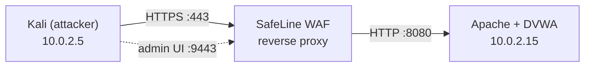

SafeLine and DVWA live on the same Ubuntu VM. SafeLine takes ports 80/443, so Apache has to move to 8080. Every request from Kali goes through the WAF first.

| Machine | IP | Role |
|---|---|---|
| Kali Linux | 10.0.2.5 | Attacker |
| Ubuntu Server 22.04 | 10.0.2.15 | DVWA + SafeLine (Docker) |

## What you need

- VirtualBox, a Kali VM, and an Ubuntu Server 22.04 VM
- About 4 GB RAM for the Ubuntu VM (SafeLine runs several Docker containers)
- Internet access from the VMs for installs

## Build it

### 1. Network

Put both VMs on a **NAT Network** (not Bridged). They can talk to each other and reach the internet, but the vulnerable app stays off your home network.

Check it from Kali:

```bash
ping 10.0.2.15
```

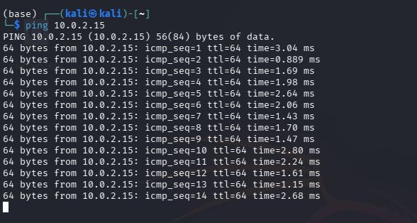

### 2. Web stack on Ubuntu

```bash
sudo apt-get update && sudo apt-get upgrade -y
sudo apt-get install -y net-tools openssl apache2 php php-mysql mysql-server git
sudo mysql_secure_installation
```

Open `http://10.0.2.15` from Kali. If you see the Apache default page, the web server and network both work.

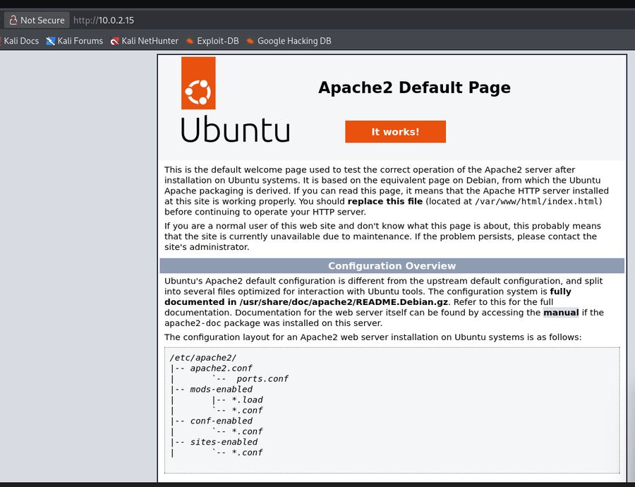

### 3. DVWA

```bash
cd /var/www/html
sudo git clone https://github.com/digininja/DVWA.git
sudo chown -R www-data:www-data DVWA
sudo chmod -R 755 DVWA
sudo cp DVWA/config/config.inc.php.dist DVWA/config/config.inc.php
```

Create the database and user:

```sql
-- sudo mysql -u root
CREATE DATABASE dvwa;
CREATE USER 'dvwa_user'@'localhost' IDENTIFIED BY 'p@ssw0rd';
GRANT ALL ON dvwa.* TO 'dvwa_user'@'localhost';
FLUSH PRIVILEGES;
```

Then edit `DVWA/config/config.inc.php` so these three lines match (use your own password if you like):

```php
$_DVWA['db_database'] = 'dvwa';
$_DVWA['db_user']     = 'dvwa_user';
$_DVWA['db_password'] = 'p@ssw0rd';
```

### 4. Move Apache to port 8080

SafeLine needs 80/443, so Apache steps aside. Two edits:

- `/etc/apache2/ports.conf`: change `Listen 80` to `Listen 8080`
- `/etc/apache2/sites-available/000-default.conf`: change `<VirtualHost *:80>` to `<VirtualHost *:8080>`

```bash
sudo systemctl restart apache2
```

Browse to `http://10.0.2.15:8080/DVWA/setup.php` from Kali and click **Create / Reset Database**.

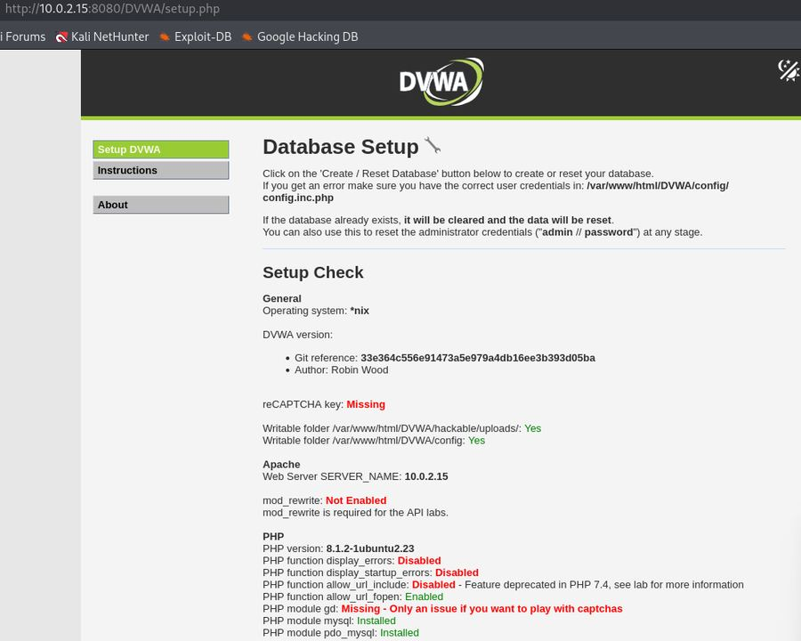

### 5. Friendly hostname

On **both** VMs, add this to `/etc/hosts`:

```text
10.0.2.15    dvwa.local www.dvwa.local
```

Check with `ping dvwa.local` from Kali.

### 6. Self-signed certificate

```bash
sudo mkdir /etc/ssl/dvwa
sudo openssl req -x509 -nodes -days 365 -newkey rsa:2048 \
  -keyout /etc/ssl/dvwa/dvwa.key \
  -out /etc/ssl/dvwa/dvwa.crt
```

Use `dvwa.local` as the Common Name.

### 7. Install SafeLine

```bash
sudo bash -c "$(curl -fsSLk https://waf.chaitin.com/release/latest/manager.sh)" -- --en
```

Choose **1. Install**, let it install Docker if needed, and accept the default path. At the end it prints the admin URL (`https://10.0.2.15:9443`) and a generated password. Save it somewhere safe.

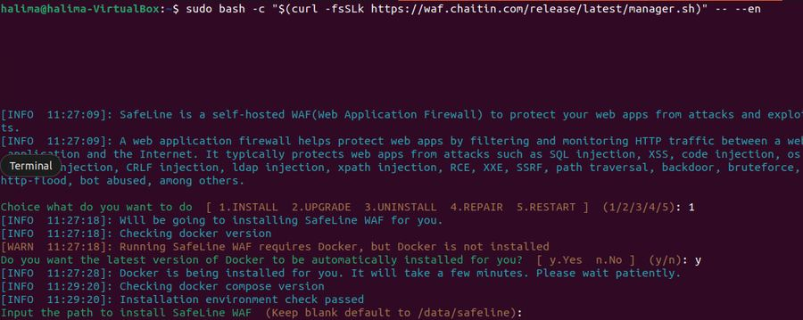

Log in from Kali (accept the certificate warning). This is the dashboard:

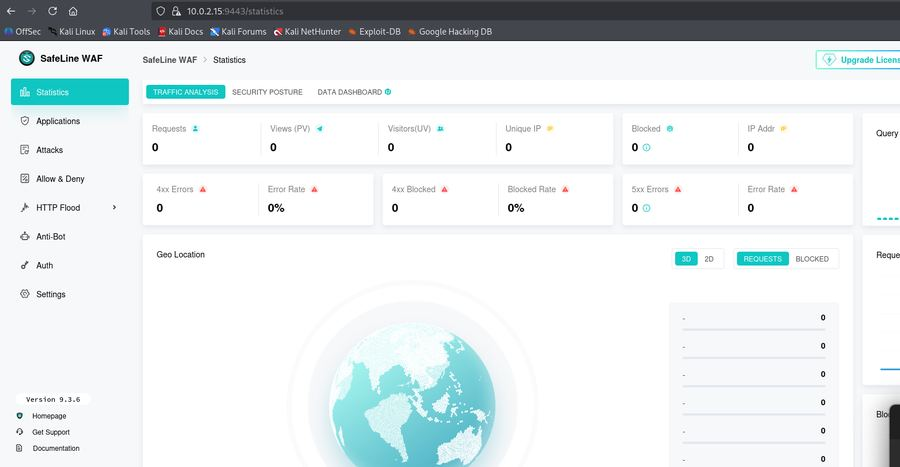

### 8. Add the certificate and the app

**Certificate:** in SafeLine go to *Settings → Certificates → Add*, and paste in the contents of `dvwa.crt` and `dvwa.key` (get them with `sudo cat`).

**Application:** *Applications → Add Application*, then:

| Field | Value |
|---|---|
| Domain | `dvwa.local`, `www.dvwa.local` |
| Port | `443`, HTTPS |
| SSL cert | the one you just added |
| Mode | Reverse Proxy |
| Upstream | `http://10.0.2.15:8080` |
| Name | DVWA |

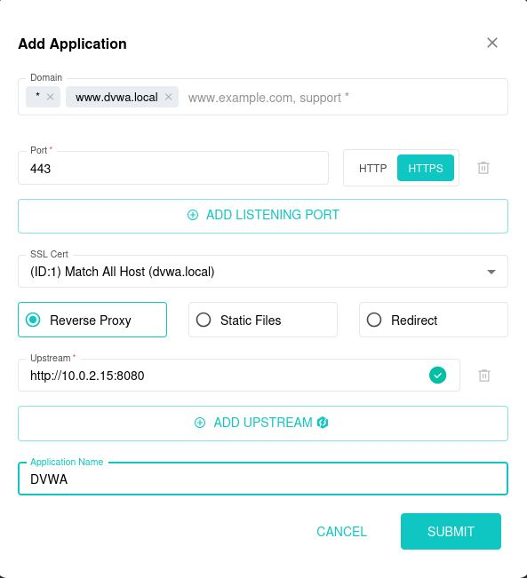

Now `https://dvwa.local/DVWA` from Kali goes through the WAF. Log in to DVWA (`admin` / `password`), open **DVWA Security**, and set the level to **Low**.

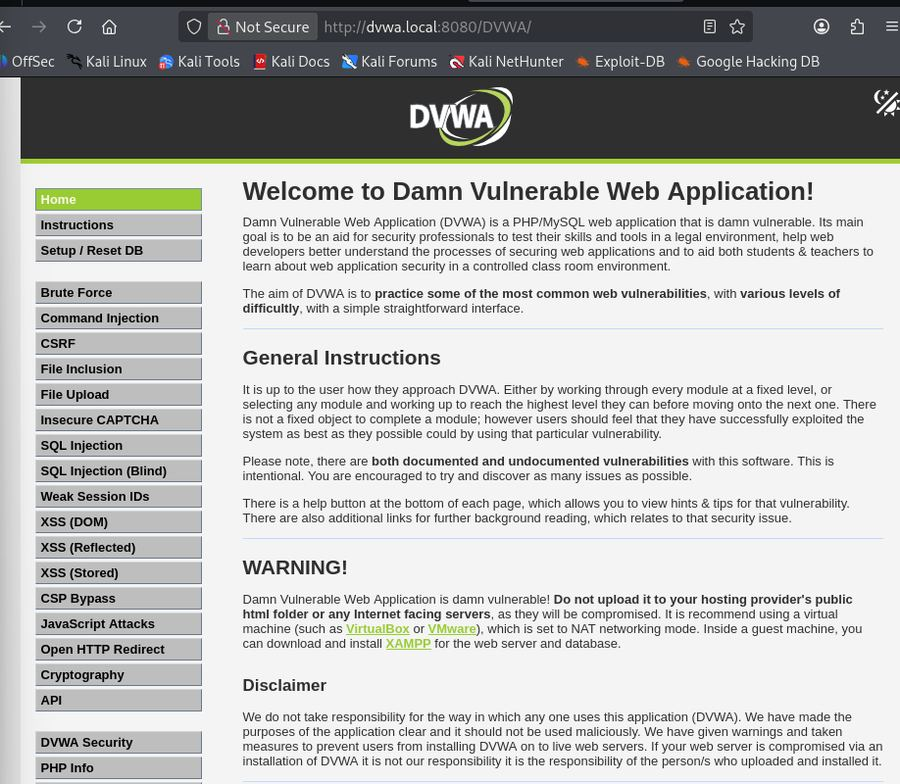

## Attacking it

All from Kali, against `https://dvwa.local/DVWA`, with security on Low.

| Test | What I did | Result |
|---|---|---|
| SQL injection | `1' OR '1'='1` in the SQL Injection page | **Blocked** |
| XSS | `<script>alert('XSS')</script>` in Reflected XSS | **Blocked** |
| Command injection | `; ls -la /etc` in the Command Injection page | **Logged, not blocked** (see below) |
| HTTP flood | `for i in {1..200}; do curl -k https://dvwa.local/; done` | **Challenged** by rate limiting |
| IP deny rule | Deny rule on source IP `10.0.2.5` | **Forbidden** |
| Auth gateway | SSO login required in front of DVWA | **Enforced** |

### SQL injection and XSS

The WAF returned its block page and logged the attack type and source IP.

<table>
  <tr>
    <td>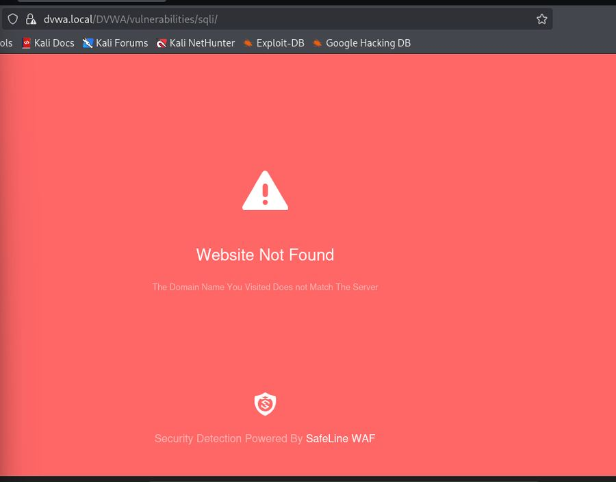</td>
    <td>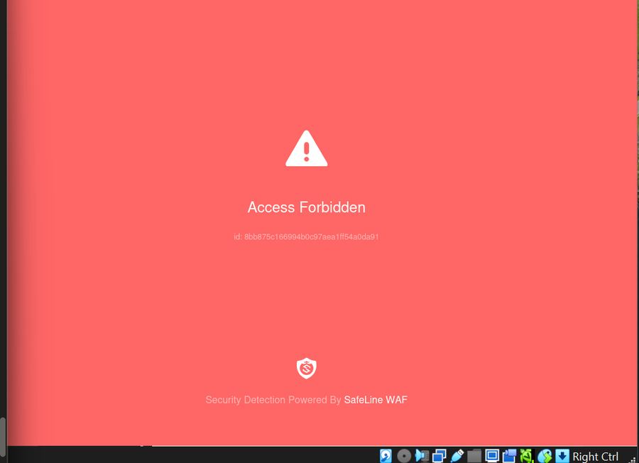</td>
  </tr>
  <tr>
    <td>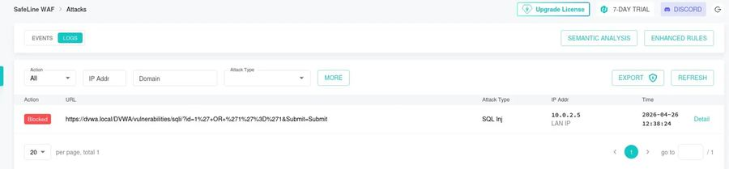</td>
    <td>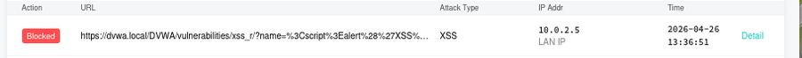</td>
  </tr>
</table>

### Command injection: detected, but it got through

This one taught me the most. The WAF recognised the attack and logged it as `Cmd Inj`, but the action was **Audited**, not Blocked, and DVWA happily printed the contents of `/etc`.

<table>
  <tr>
    <td>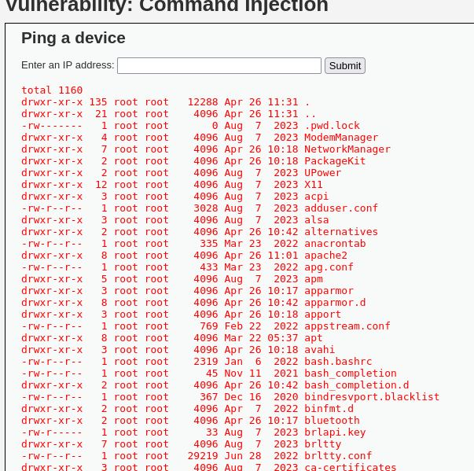</td>
    <td>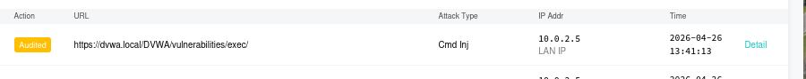</td>
  </tr>
</table>

Detecting an attack and stopping it are different settings. Next on my list is switching that rule to block mode and re-testing.

### HTTP flood and the IP deny rule

*HTTP Flood → Settings*: I turned on the three basic limits (access, attack, error). Running the curl loop got Kali flagged after 100 requests in 10 seconds, and SafeLine served an Anti-Bot challenge instead of DVWA.

Then I added a deny rule (*Allow & Deny → Blacklist*: Source IP equals `10.0.2.5`, action Deny). After that, Kali got *Access Forbidden* for everything.

<table>
  <tr>
    <td>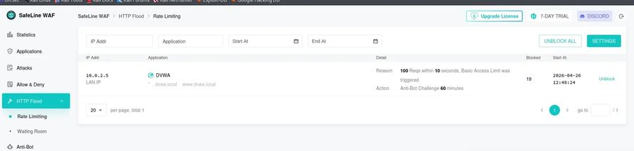</td>
    <td>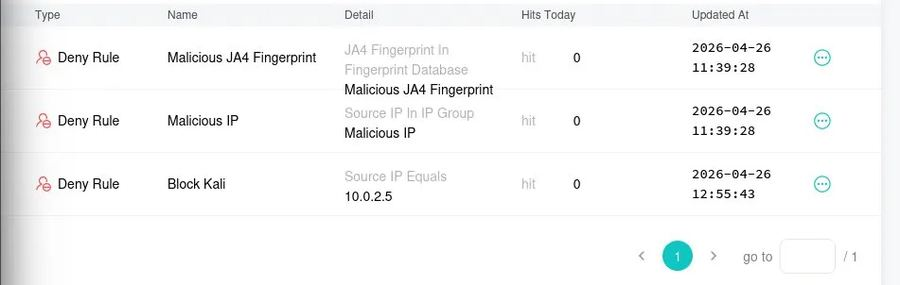</td>
    <td>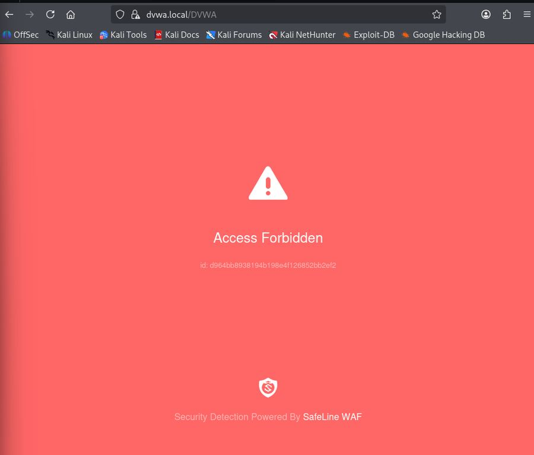</td>
  </tr>
</table>

### Auth gateway (SSO)

*Auth → Settings*: I created a user, set up the SSO portal on `https://dvwa.local:8443`, and enabled DVWA for that user under *User Management*. Visitors now sign in through SafeLine before they can reach the app.

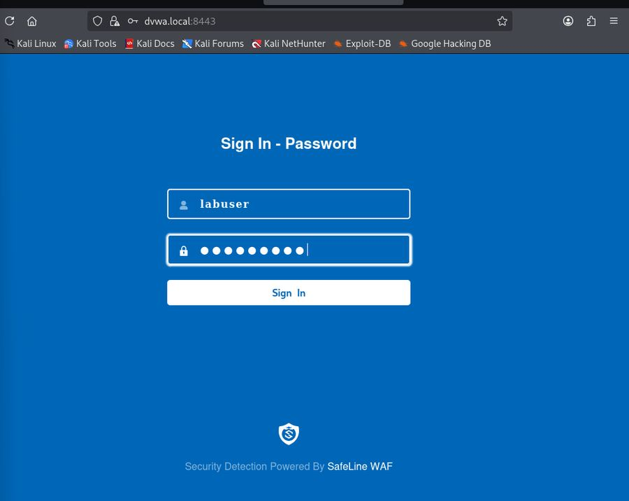

## What I learned

- **A WAF is a reverse proxy.** Seeing the upstream setting (`http://10.0.2.15:8080`) made it click that the app never sees the request unless the WAF lets it through.
- **Port order matters.** Apache had to move off 80/443 before SafeLine could use them.
- **Name resolution has to work on both machines.** `dvwa.local` needed a hosts entry on Kali and on Ubuntu.
- **Audit mode is not protection.** The command injection test showed me the difference between logging and blocking.
- **Layers stack.** Rate limiting, IP rules, and an auth gateway each stop things the attack signatures don't.
- **NAT Network over Bridged** keeps an intentionally vulnerable app away from the rest of my network.

## Credits

Built with [DVWA](https://github.com/digininja/DVWA) and [SafeLine WAF](https://github.com/chaitin/SafeLine).
