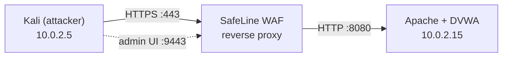

# WAF Home Lab with SafeLine

A home lab where I put a deliberately vulnerable web app (DVWA) behind SafeLine WAF, attacked it from Kali Linux, and looked at what the WAF detected, blocked, and missed. I built it to understand how a Web Application Firewall works as a reverse proxy in front of an application.

The full setup, step by step, is in [BUILD-GUIDE.md](BUILD-GUIDE.md).

## Lab setup

| Component | Details |
|---|---|
| Hypervisor | Oracle VirtualBox, NAT Network (`10.0.2.0/24`) |
| Attacker | Kali Linux, `10.0.2.5` |
| Target | Ubuntu Server 22.04 LTS, `10.0.2.15` |
| Web stack | Apache2, PHP 8.1, MySQL 8.0 |
| Vulnerable app | DVWA (security level Low) |
| WAF | SafeLine v9.3.6, running in Docker |
| TLS | Self-signed certificate for `dvwa.local` |

## What I tested

| Test | Payload / method | Result |
|---|---|---|
| SQL injection | `1' OR '1'='1` | Blocked |
| Reflected XSS | `` | Blocked |
| Command injection | `; ls -la /etc` | Detected and logged, but not blocked |
| HTTP flood | 200 rapid `curl` requests | Rate limit triggered, Anti-Bot challenge served |
| IP deny rule | Deny source IP `10.0.2.5` | Access Forbidden |
| Auth gateway | SafeLine SSO in front of DVWA | Login required before reaching the app |

<table>
  <tr>
    <td></td>
    <td></td>
  </tr>
</table>

## What I learned

- A WAF is a reverse proxy. The app only sees a request if the WAF forwards it.
- Detecting an attack and blocking it are separate settings. My command injection test was logged as *Audited*, so the payload still ran.
- Apache had to move to port 8080 so SafeLine could take 80/443.
- Rate limiting, IP rules, and an auth gateway each cover things attack signatures don't.
- A NAT Network keeps the vulnerable app off my home network, which Bridged mode would not.

## Credits

[DVWA](https://github.com/digininja/DVWA) and [SafeLine WAF](https://github.com/chaitin/SafeLine).

DVWA is intentionally vulnerable. This lab runs on an isolated network and is not meant to be exposed to the internet.
