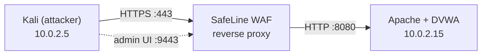

# WAF Home Lab with SafeLine

Built this lab to learn how a Web Application Firewall actually sits in front of an app, what it catches, and what it doesn't. I put a deliberately vulnerable app (DVWA) behind SafeLine WAF, attacked it from Kali, and watched what happened.

Everything runs in VirtualBox on one machine. This page is the overview and my results. The step-by-step build is in **[BUILD-GUIDE.md](BUILD-GUIDE.md)**.

> **Lab only.** DVWA is intentionally vulnerable. Keep it on an isolated network and never expose it to the internet.

## What it looks like

SafeLine and DVWA live on the same Ubuntu VM. SafeLine takes ports 80/443, so Apache has to move to 8080. Every request from Kali goes through the WAF first.

| Machine | IP | Role |
|---|---|---|
| Kali Linux | 10.0.2.5 | Attacker |
| Ubuntu Server 22.04 | 10.0.2.15 | DVWA + SafeLine (Docker) |

## Results

All attacks ran from Kali against DVWA (security level Low) with SafeLine in front.

| Test | What I did | Result |
|---|---|---|
| SQL injection | `1' OR '1'='1` in the SQL Injection page | **Blocked** |
| XSS | `` in Reflected XSS | **Blocked** |
| Command injection | `; ls -la /etc` in the Command Injection page | **Logged, not blocked** (see below) |
| HTTP flood | `for i in {1..200}; do curl -k https://dvwa.local/; done` | **Challenged** by rate limiting |
| IP deny rule | Deny rule on source IP `10.0.2.5` | **Forbidden** |
| Auth gateway | SSO login required in front of DVWA | **Enforced** |

<table>
  <tr>
    <td></td>
    <td></td>
  </tr>
</table>

The command injection test is worth reading about: the WAF *detected* it but only *audited* it, so the payload still ran. Details are in the [build guide](BUILD-GUIDE.md#command-injection-detected-but-it-got-through).

## Build it yourself

Follow **[BUILD-GUIDE.md](BUILD-GUIDE.md)**. It covers the network, DVWA, moving Apache to 8080, the certificate, installing SafeLine, onboarding the app, and every test above.

## What I learned

- **A WAF is a reverse proxy.** Seeing the upstream setting (`http://10.0.2.15:8080`) made it click that the app never sees the request unless the WAF lets it through.
- **Port order matters.** Apache had to move off 80/443 before SafeLine could use them.
- **Name resolution has to work on both machines.** `dvwa.local` needed a hosts entry on Kali and on Ubuntu.
- **Audit mode is not protection.** The command injection test showed me the difference between logging and blocking.
- **Layers stack.** Rate limiting, IP rules, and an auth gateway each stop things the attack signatures don't.
- **NAT Network over Bridged** keeps an intentionally vulnerable app away from the rest of my network.

## Credits

Built with [DVWA](https://github.com/digininja/DVWA) and [SafeLine WAF](https://github.com/chaitin/SafeLine).
