<div align="center">

# Web Application Firewall Home Lab
### using SafeLine WAF

*VirtualBox · Kali Linux · Ubuntu Server · DVWA · SafeLine WAF*

By **Halima** · April 2026

</div>

---

## Table of Contents

1. [Introduction](#1-introduction)
2. [Lab Environment](#2-lab-environment)
3. [Lab Setup Steps](#3-lab-setup-steps)
4. [Attack Demonstrations](#4-attack-demonstrations)
5. [Lab Summary](#5-lab-summary)
6. [Conclusion](#6-conclusion)

---

## 1. Introduction

This lab documents the setup of a complete cybersecurity home lab using VirtualBox, Kali Linux, Ubuntu Server, and SafeLine WAF. The purpose is to demonstrate how a Web Application Firewall (WAF) can protect a vulnerable web application against common web attacks.

**Lab objectives**

- Set up a vulnerable web application (DVWA) on Ubuntu Server
- Demonstrate SQL injection, XSS, and command injection attacks from Kali Linux
- Show how SafeLine WAF detects, logs, and blocks such attacks
- Explore advanced WAF features including HTTP flood defense, custom deny rules, and an authentication gateway

### IP map

| VM     | IP         | Role          |
|--------|------------|---------------|
| Kali   | `10.0.2.5`  | Attacker      |
| Ubuntu | `10.0.2.15` | Target server |

**Ubuntu IP**

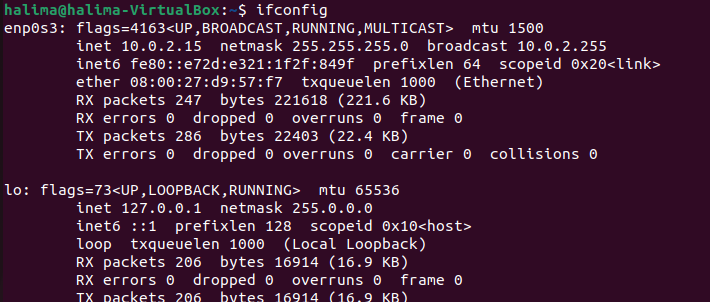

**Kali IP**

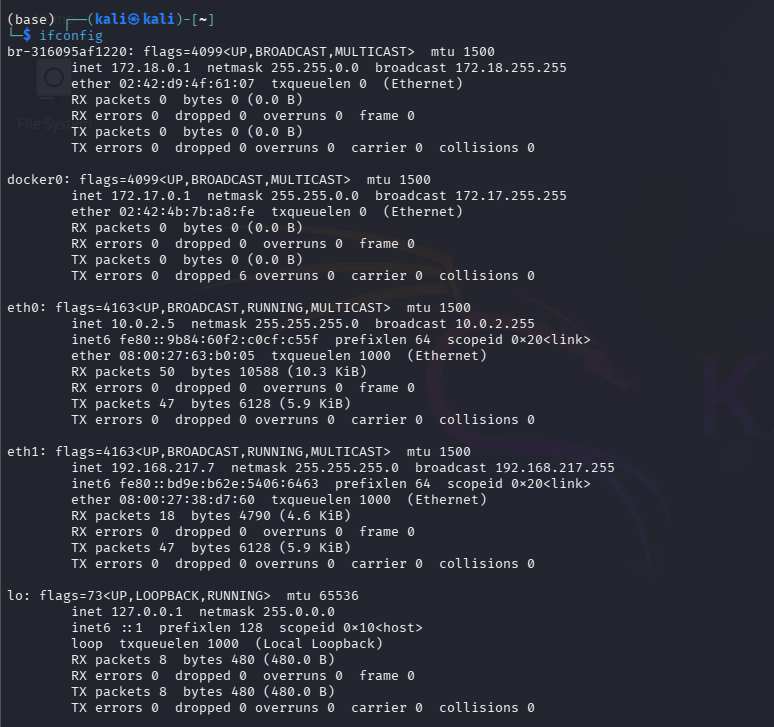

---

## 2. Lab Environment

### 2.1 Network Configuration

Both virtual machines use a **NAT Network** in VirtualBox, placing them on the same isolated subnet (`10.0.2.0/24`) while still allowing internet access through the host. This is safer than Bridged networking because it keeps the intentionally vulnerable DVWA application isolated from the local home network.

### 2.2 Technology Stack

| Component      | Details                                   |
|----------------|-------------------------------------------|
| Hypervisor     | Oracle VirtualBox                         |
| Attacker VM    | Kali Linux (`10.0.2.5`)                    |
| Target VM      | Ubuntu Server 22.04 LTS (`10.0.2.15`)      |
| Web Stack      | Apache2, PHP 8.1, MySQL 8.0 (LAMP)        |
| Vulnerable App | DVWA (Damn Vulnerable Web Application)    |
| WAF            | SafeLine WAF v9.3.6 (Docker-based)        |
| Networking     | VirtualBox NAT Network                    |
| SSL            | Self-signed certificate for `dvwa.local`  |

---

## 3. Lab Setup Steps

### Step 1 – Verify Network Connectivity

After configuring both VMs on the NAT Network, connectivity was verified by running `ifconfig` on each VM to confirm their IP addresses, then pinging Ubuntu from Kali.

```bash
ping 10.0.2.15
```

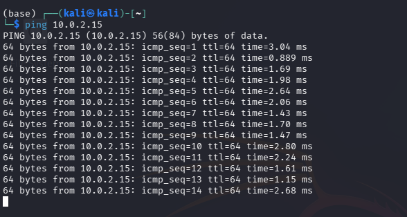

**Result:** Kali reached Ubuntu with consistent response times of 1–3 ms, confirming NAT Network routing was working correctly.

---

### Step 2 – Ubuntu Initial Setup

The Ubuntu Server was updated and the required tools were installed:

```bash
sudo apt-get update
sudo apt-get upgrade -y
sudo apt-get install -y net-tools
sudo apt-get install -y openssl
```

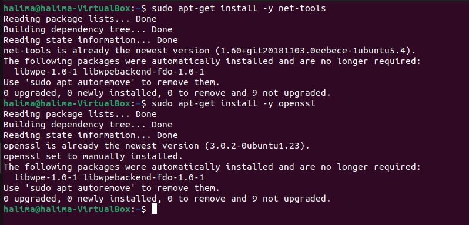

---

### Step 3 – Install LAMP Stack

Apache2, PHP, MySQL, and Git were installed as the foundation for hosting DVWA.

```bash
sudo apt-get install -y apache2 php php-mysql mysql-server git
```

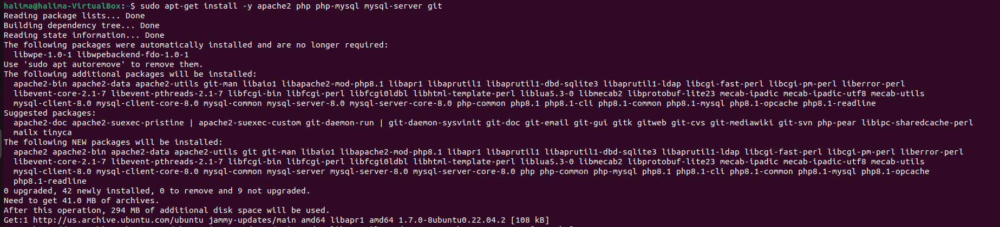

MySQL was then secured with the secure installation script, which removes anonymous users, disables remote root login, and removes the test database.

```bash
sudo mysql_secure_installation
```

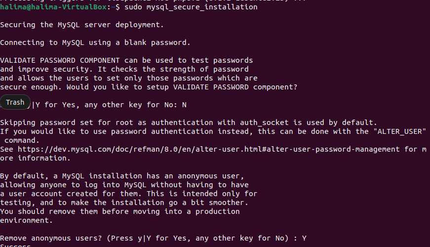
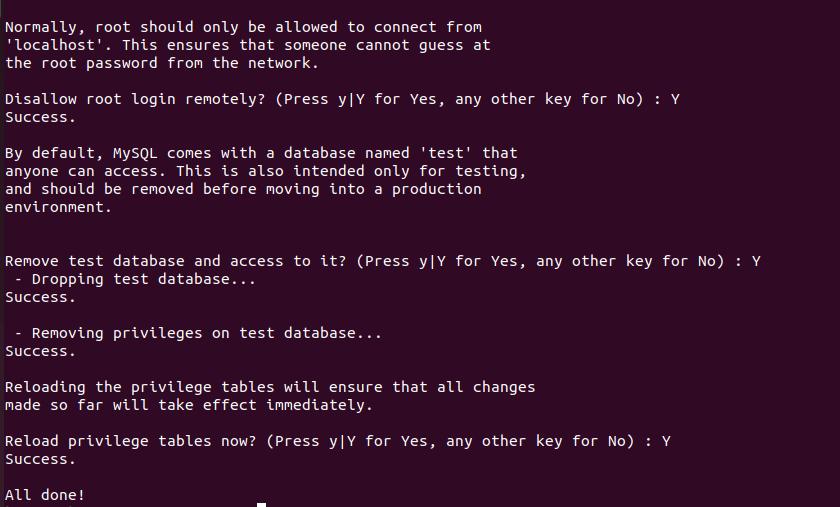

Verify Apache is running:

```bash
sudo systemctl status apache2
```

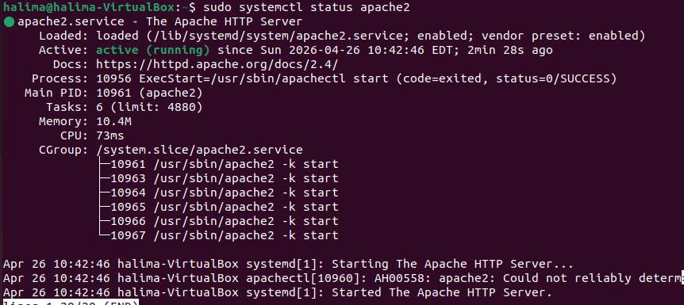

Then, from Kali, open a browser and go to `http://10.0.2.15`. The default Apache2 Ubuntu page confirms that Apache is working and Kali can reach Ubuntu's web server.

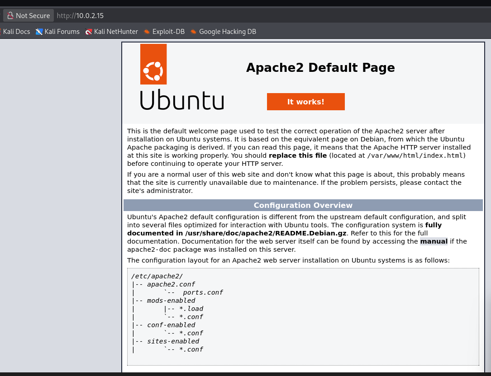

---

### Step 4 – Install and Configure DVWA

DVWA was cloned from GitHub into Apache's web root and configured to connect to a dedicated MySQL database. On Ubuntu:

```bash
cd /var/www/html
sudo git clone https://github.com/digininja/DVWA.git
```

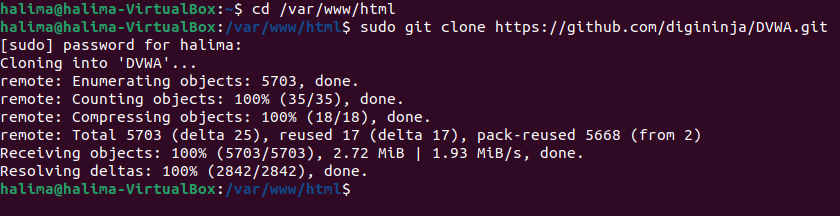

Set permissions:

```bash
sudo chown -R www-data:www-data DVWA
sudo chmod -R 755 DVWA
```

Copy and edit the config file:

```bash
sudo cp /var/www/html/DVWA/config/config.inc.php.dist /var/www/html/DVWA/config/config.inc.php
sudo nano /var/www/html/DVWA/config/config.inc.php
```

Make sure these lines match exactly:

```php
$_DVWA['db_database'] = 'dvwa';
$_DVWA['db_user']     = 'dvwa_user';
$_DVWA['db_password'] = 'p@ssw0rd';
```

Save and exit with `Ctrl+X` → `Y` → `Enter`.

Create a dedicated MySQL database and user (press Enter at the password prompt, since no root password is set):

```bash
sudo mysql -u root -p
```

```sql
CREATE DATABASE dvwa;
CREATE USER 'dvwa_user'@'localhost' IDENTIFIED BY 'p@ssw0rd';
GRANT ALL ON dvwa.* TO 'dvwa_user'@'localhost';
FLUSH PRIVILEGES;
exit;
```

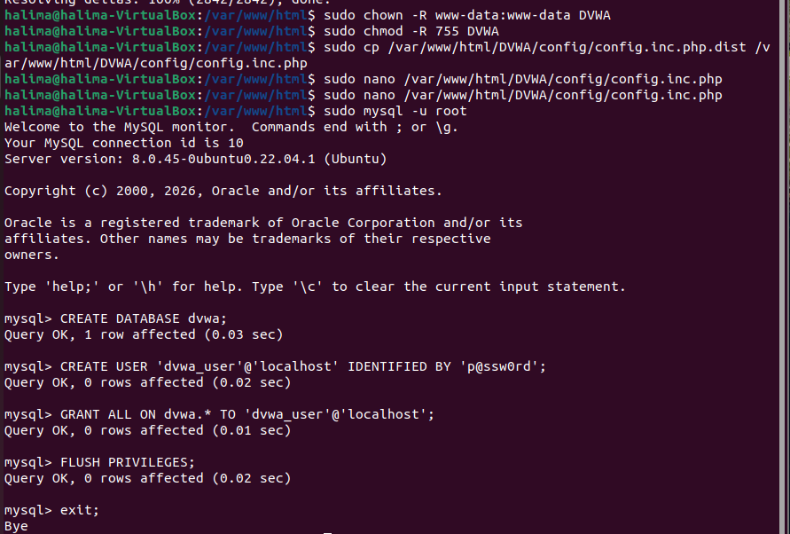

---

### Step 5 – Move DVWA to Port 8080

SafeLine WAF takes ports 80/443, so Apache was reconfigured to listen on **8080**. Two files were edited.

**1. `ports.conf`**

```bash
sudo nano /etc/apache2/ports.conf
```

Change `Listen 80` to `Listen 8080`.

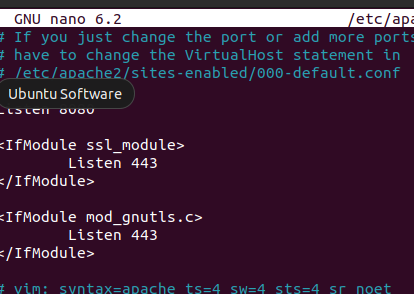

**2. The default virtual host**

```bash
sudo nano /etc/apache2/sites-available/000-default.conf
```

Change `<VirtualHost *:80>` to `<VirtualHost *:8080>`.

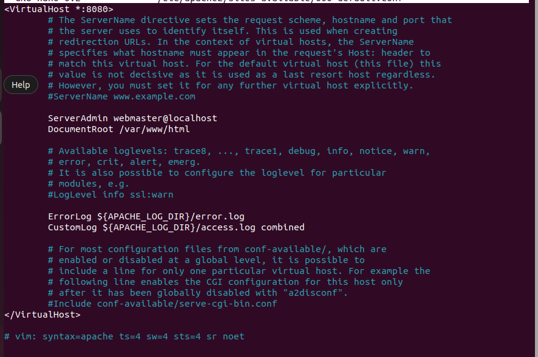

Restart Apache:

```bash
sudo systemctl restart apache2
```

**Verify DVWA is accessible** from the Kali browser at `http://10.0.2.15:8080/DVWA/setup.php`.

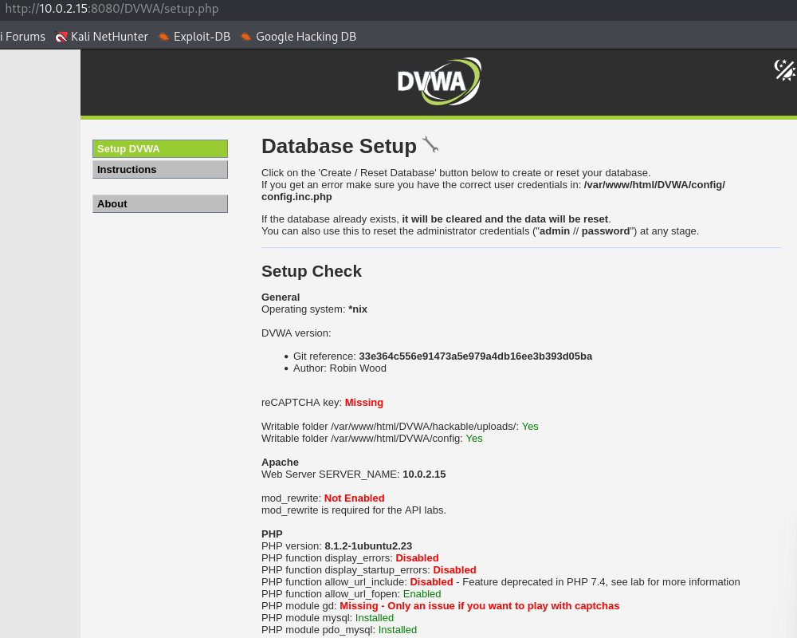

Click **Create / Reset Database** to initialise DVWA.

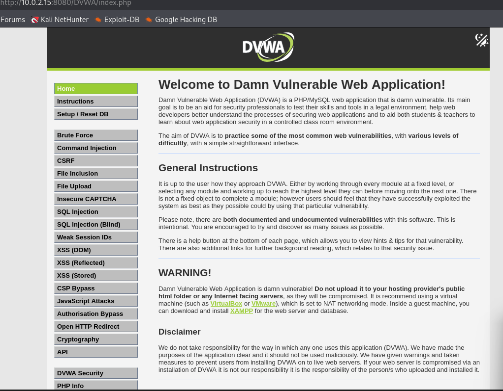

---

### Step 6 – Add Custom Database Values

Once logged in, go back to Ubuntu and run `sudo mysql -u root`, then:

```sql
USE dvwa;

CREATE TABLE test_users (
    id INT NOT NULL AUTO_INCREMENT,
    username VARCHAR(50) NOT NULL,
    password VARCHAR(50) NOT NULL,
    PRIMARY KEY (id)
);

INSERT INTO test_users (username, password) VALUES
    ('alice', 'alice123'),
    ('bob', 'bob123'),
    ('admin', 'admin123');

exit;
```

This gives real data to target when demonstrating SQL injection.

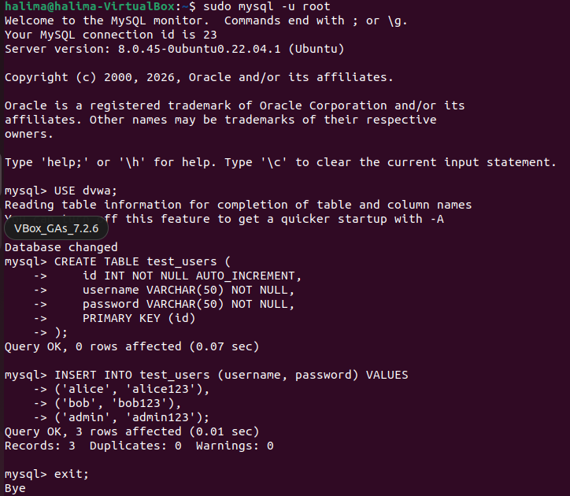

---

### Step 7 – DNS Setup

This lets both VMs use `dvwa.local` instead of the IP address.

On **Ubuntu** (`sudo nano /etc/hosts`) and on **Kali** (`sudo nano /etc/hosts`), add this line at the bottom:

```text
10.0.2.15    dvwa.local www.dvwa.local
```

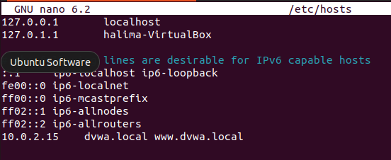
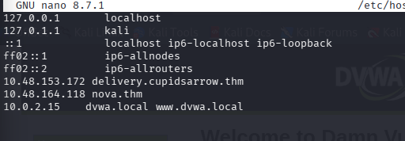

**Verify DNS** from Kali:

```bash
ping dvwa.local
```

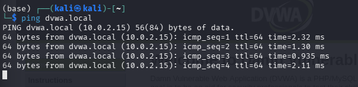

It should resolve to `10.0.2.15` and reply. You can also browse to `http://dvwa.local:8080/DVWA` from Kali and see the DVWA login page via the domain name.

---

### Step 8 – Create a Self-Signed SSL Certificate

On Ubuntu:

```bash
sudo mkdir /etc/ssl/dvwa
sudo openssl req -x509 -nodes -days 365 -newkey rsa:2048 \
  -keyout /etc/ssl/dvwa/dvwa.key \
  -out /etc/ssl/dvwa/dvwa.crt
```

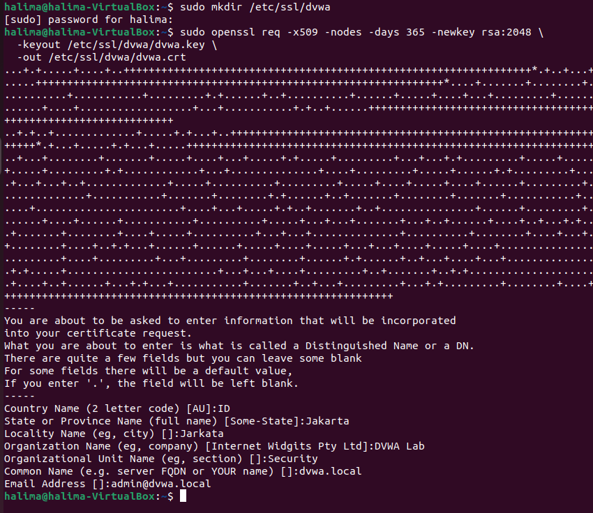

Verify the certificate was created:

```bash
ls /etc/ssl/dvwa/
```

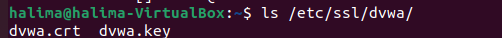

---

### Step 9 – Install SafeLine WAF

On Ubuntu:

```bash
sudo bash -c "$(curl -fsSLk https://waf.chaitin.com/release/latest/manager.sh)" -- --en
```

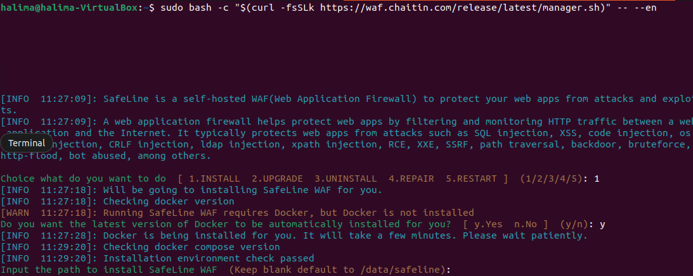

When it finishes, the installer prints the management URL and a generated admin password:

```text
URL:      https://10.0.2.15:9443
Username: admin
Password: <generated by the installer>
```

While installing, SafeLine:

- Runs as a set of Docker containers on Ubuntu
- Sets up an Nginx-based reverse proxy that sits in front of DVWA
- Opens port **9443** for the admin UI
- Opens ports **80/443** to receive traffic and forward it to DVWA on 8080

---

### Step 10 – Log into SafeLine

From the Kali browser, go to `https://10.0.2.15:9443`. A certificate warning is expected: click **Advanced → Accept the Risk and Continue**.

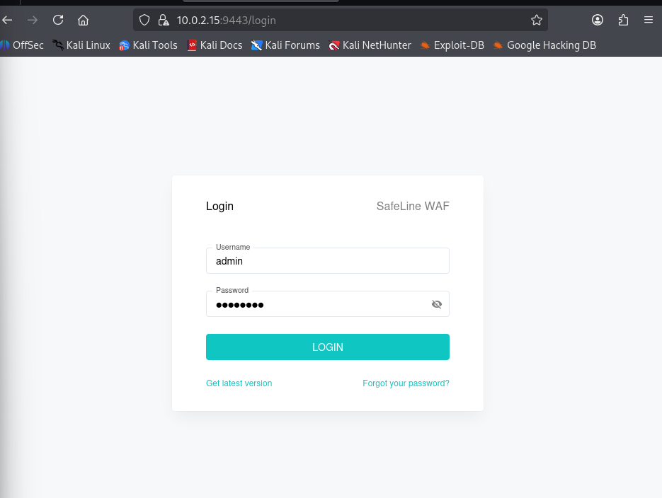

**The dashboard**

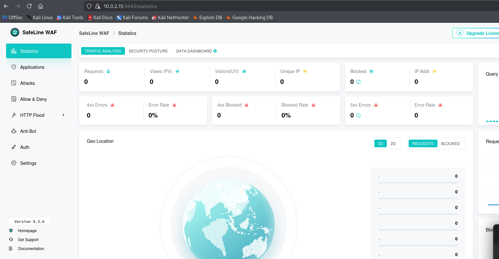

---

### Step 11 – Import the SSL Certificate

In the SafeLine dashboard on Kali:

1. Go to **Settings → Certificates**
2. Click **Add**
3. Paste the certificate and key contents into the text boxes

To get the file contents, run on Ubuntu:

```bash
sudo cat /etc/ssl/dvwa/dvwa.crt
sudo cat /etc/ssl/dvwa/dvwa.key
```

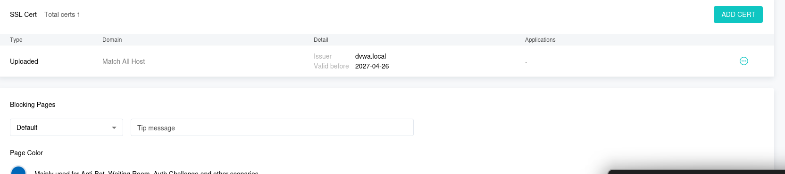

---

### Step 12 – Onboard DVWA into SafeLine

In the SafeLine dashboard, open **Applications → Add Application** and fill in:

| Field            | Value                                             |
|------------------|---------------------------------------------------|
| Domain           | `dvwa.local`, `www.dvwa.local` (plus the `*` wildcard) |
| Port             | `443` with **HTTPS**                              |
| SSL Cert         | `(ID:1) Match All Host (dvwa.local)`              |
| Mode             | **Reverse Proxy**                                 |
| Upstream         | `http://10.0.2.15:8080`                           |
| Application Name | `DVWA`                                            |

Then click **Submit**.

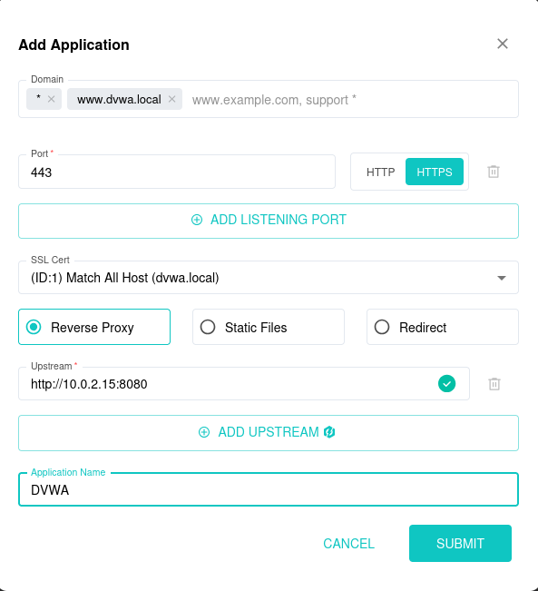

From the Kali browser, go to `https://dvwa.local/DVWA`:

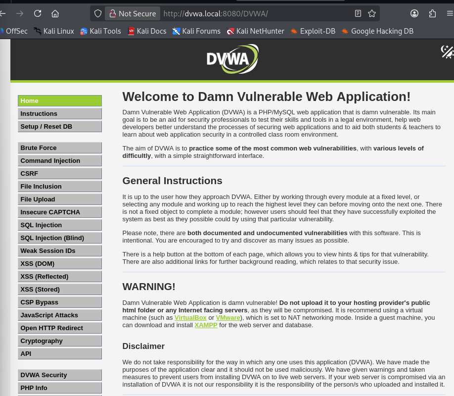

Log in to DVWA, then:

1. Click **DVWA Security** in the left menu
2. Set the security level to **Low**
3. Click **Submit**

---

## 4. Attack Demonstrations

### 4.1 SQL Injection

With security set to Low, open **SQL Injection** in the left menu and enter this in the User ID box:

```text
1' OR '1'='1
```

Click **Submit**. SafeLine serves its block page:

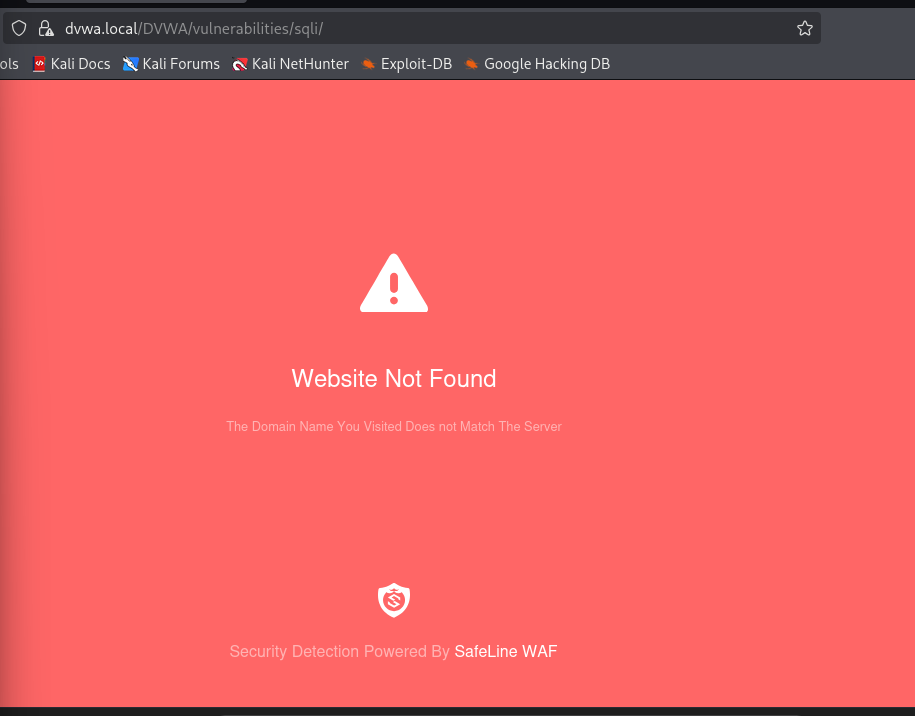

In the SafeLine dashboard (`https://10.0.2.15:9443`) the attack appears in the logs:

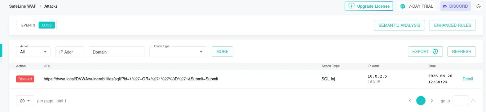

SafeLine WAF detected and blocked the SQL injection from Kali.

---

### 4.2 HTTP Flood Defense

This protects against DoS attacks where Kali sends hundreds of requests per second to overwhelm the server.

In the SafeLine dashboard, click **HTTP Flood** in the left sidebar.

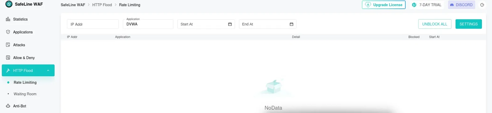

Click **Settings** (top right) to configure the rate limiting rules, and toggle **ON** all three:

1. Basic Access Limit
2. Basic Attack Limit
3. Basic Error Limit

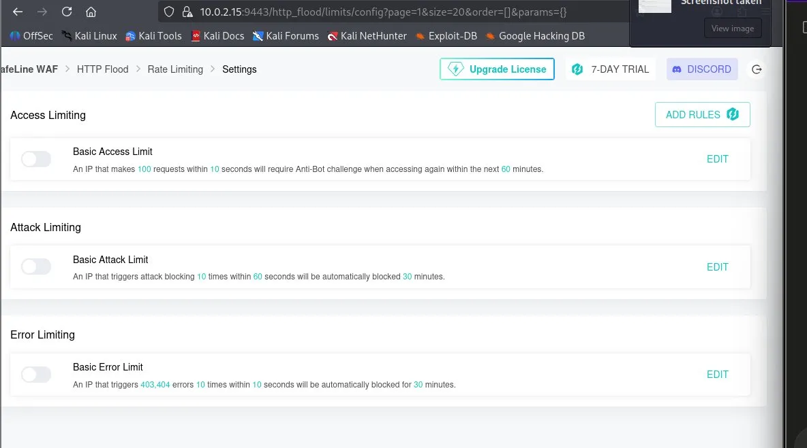

Test it from the Kali terminal by flooding DVWA with requests:

```bash
for i in {1..200}; do curl -k https://dvwa.local/ ; done
```

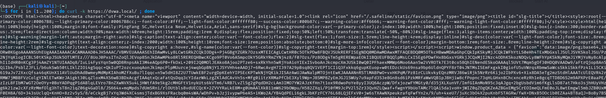

HTTP Flood Defense works. Kali was blocked for sending too many requests, and the terminal received SafeLine's Anti-Bot Challenge page instead of DVWA.

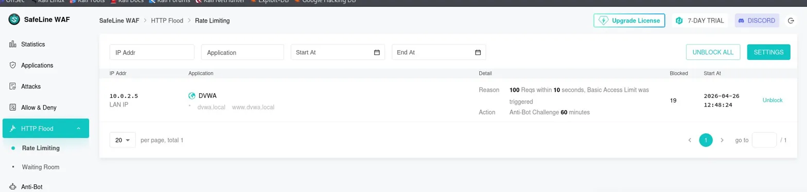

---

### 4.3 Block Kali's IP Completely

Open the **Allow & Deny** page, switch to the **Blacklist** tab, click **Add Rules**, and create:

| Field  | Value        |
|--------|--------------|
| Name   | `Block Kali` |
| Type   | Source IP    |
| Value  | `10.0.2.5`   |
| Action | Deny         |

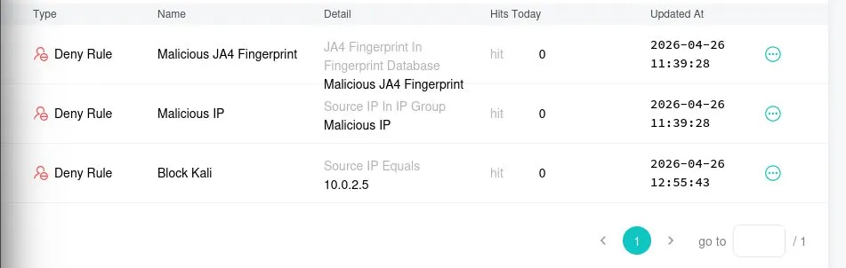

Test it from the Kali browser at `https://dvwa.local/DVWA`:

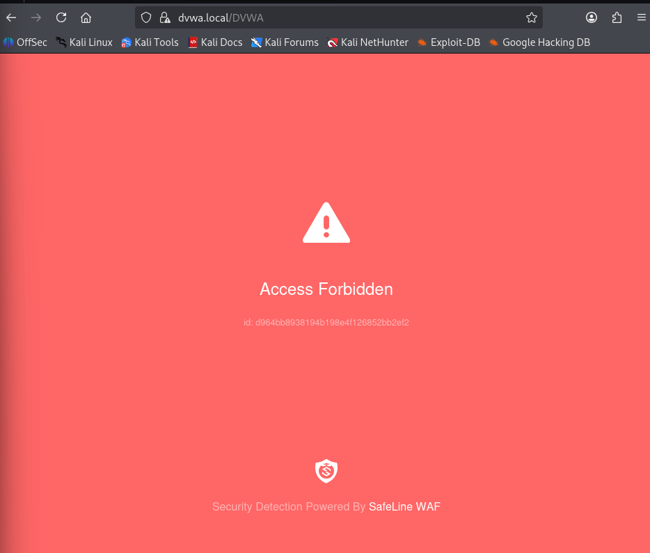

Kali is completely blocked and receives *Access Forbidden*.

---

### 4.4 Auth Gateway

This forces anyone visiting DVWA to authenticate through SafeLine before even reaching the site.

In the SafeLine dashboard go to **Auth → Settings**.

**Add a user**

| Field    | Value        |
|----------|--------------|
| Username | `labuser`    |
| Password | `Lab@12345`  |

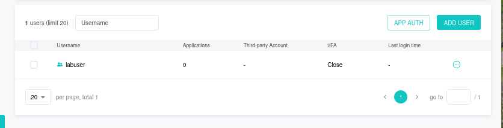

**What was configured**

1. Enabled the Auth Gateway (SSO) on SafeLine for the DVWA application
2. Created the user `labuser`
3. Configured the SSO portal on port **8443** with HTTPS
4. Went to **Auth → User Management → edit `labuser` → enable DVWA under App Auth → Save**

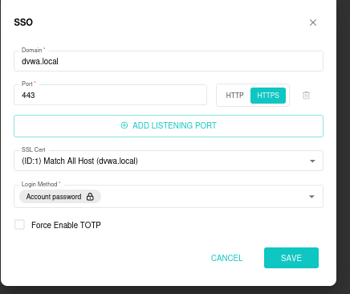
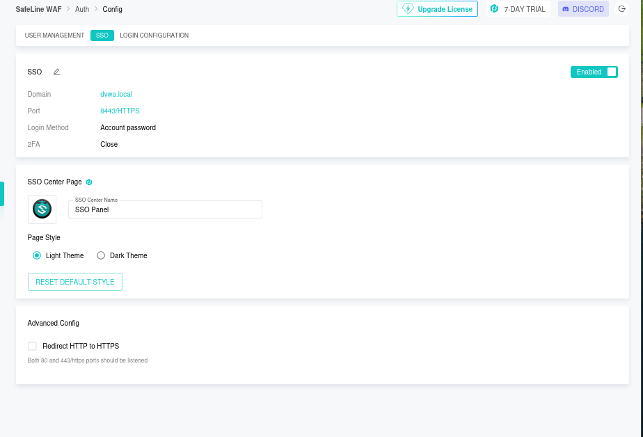

Logging in through SafeLine's SSO portal at `https://dvwa.local:8443`:

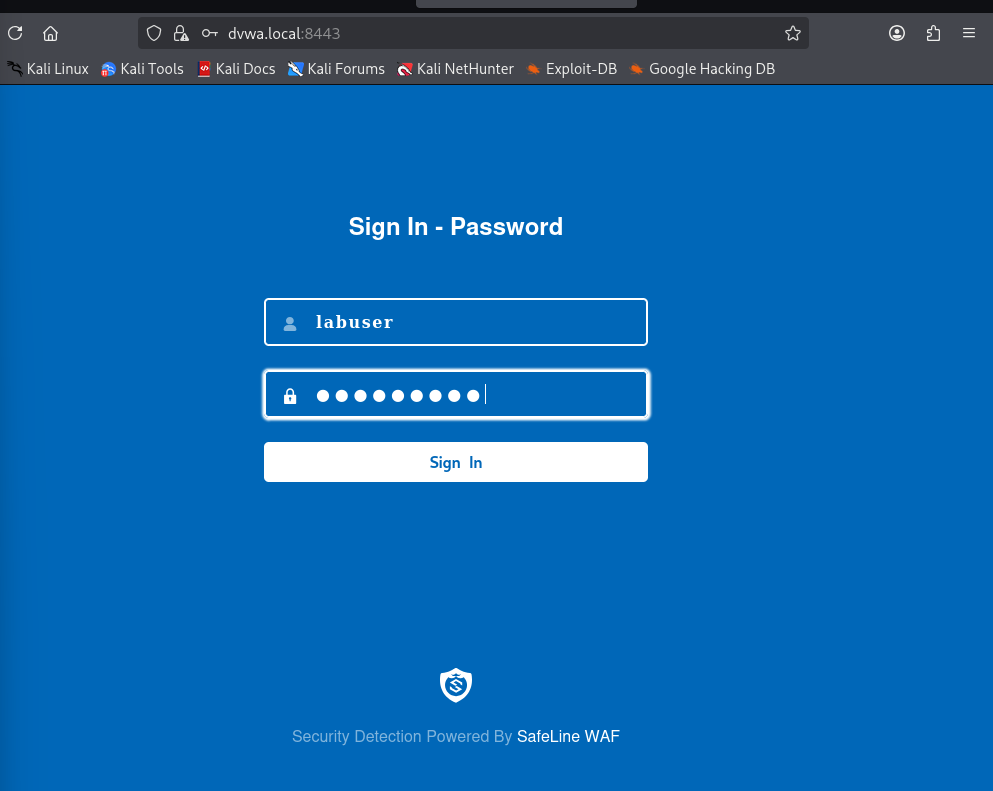
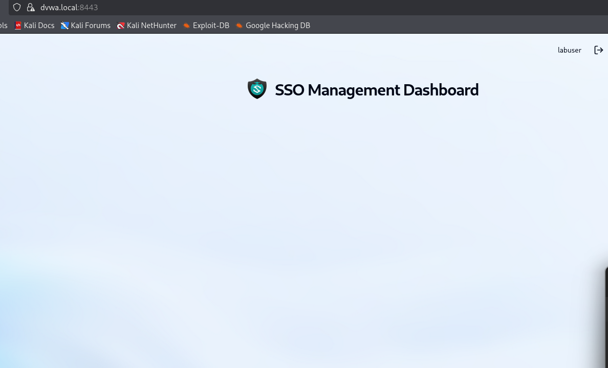

**What it proves:** anyone trying to reach DVWA must first authenticate through SafeLine's Auth Gateway, which adds an extra layer of protection in front of the vulnerable app.

---

### 4.5 XSS Attack

With DVWA security set to **Low**, open `https://dvwa.local/DVWA/vulnerabilities/xss_r/` from Kali and enter:

```html
<script>alert('XSS')</script>
```

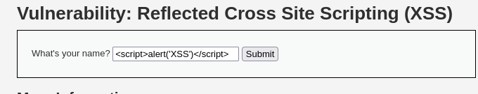

SafeLine blocks the request:

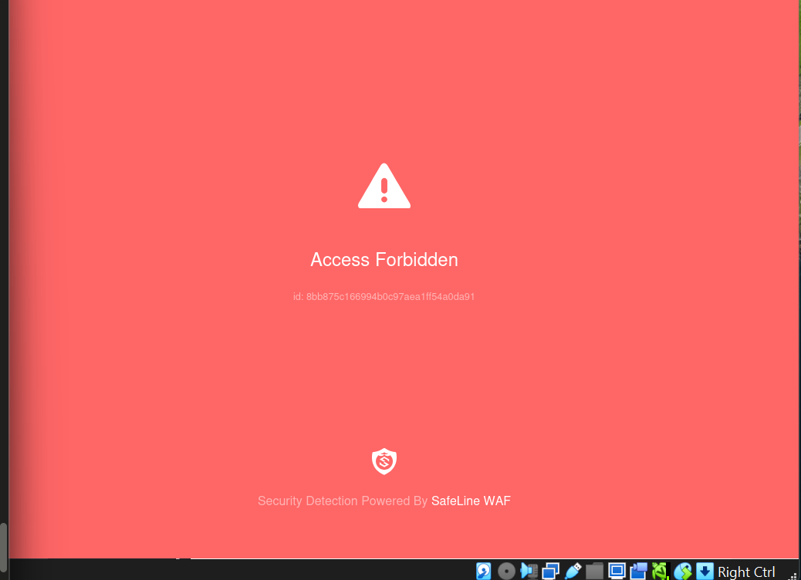

The event appears under **Attacks** in the SafeLine dashboard:

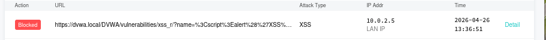

SafeLine WAF detected and blocked the XSS attack.

---

### 4.6 Command Injection

With DVWA security still on **Low**, open `https://dvwa.local/DVWA/vulnerabilities/exec/` from Kali and enter this in the IP address box:

```text
; ls -la /etc
```

This injects a system command alongside a legitimate ping request.

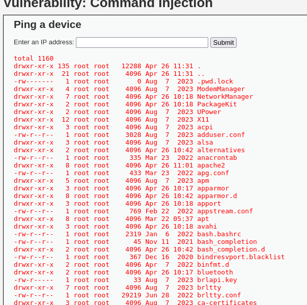

SafeLine detected and logged the attempt under **Attacks**. Note that the log entry's action is **Audited**, not Blocked, so the request was allowed through (as the `/etc` listing above shows) while still being recorded:

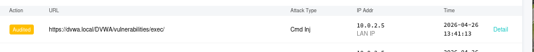

> **Takeaway:** detection alone is not protection. The rule that matched this request was in audit mode; switching it to block mode would stop the payload from reaching DVWA.

---

## 5. Lab Summary

| Component            | Status / Details                                           |
|----------------------|------------------------------------------------------------|
| NAT Network Setup    | Both VMs on `10.0.2.0/24`, internet accessible, DVWA isolated |
| LAMP Stack           | Apache2 (port 8080), PHP 8.1, MySQL 8.0, all running       |
| DVWA                 | Installed, configured, database initialised with test data |
| DNS Resolution       | `dvwa.local` resolves to `10.0.2.15` on both VMs           |
| SSL Certificate      | Self-signed cert for `dvwa.local` (365 days)               |
| SafeLine WAF         | v9.3.6 installed via Docker, admin UI on port 9443         |
| SQL Injection        | Detected and **blocked** by SafeLine                       |
| XSS Attack           | Detected and **blocked** by SafeLine                       |
| Command Injection    | Detected and **logged** (audit mode)                       |
| HTTP Flood Defense   | Rate limiting triggered at 100 req / 10 s, Kali challenged |
| Custom IP Block      | Kali IP `10.0.2.5` completely blocked via blacklist rule   |
| Auth Gateway (SSO)   | Pre-authentication enforced on port 8443 via SafeLine SSO  |

---

## 6. Conclusion

This lab demonstrated the setup and operation of a Web Application Firewall home lab using SafeLine WAF. Starting from bare virtual machines, a complete attack-and-defend environment was built, tested, and documented.

SafeLine proved effective at detecting SQL injection, Cross-Site Scripting, and command injection, and blocked the first two. Its additional features (HTTP flood rate limiting, IP-based blacklisting, and an SSO authentication gateway) provide multiple layers of defence beyond basic attack detection.

**Key takeaways**

- A WAF operates as a reverse proxy, intercepting traffic before it reaches the application
- Defence-in-depth is critical: the Auth Gateway, rate limiting, and blacklisting work together
- Detection and blocking are different: always confirm a rule's action is *Block*, not just *Audit*
- NAT Network is a safer choice than Bridged networking for labs with intentionally vulnerable apps
- Self-signed certificates enable HTTPS in isolated lab environments without a public CA

**Next steps**

- Integrate a SIEM for centralised log analysis
- Add other vulnerable apps such as OWASP Juice Shop
- Explore WAF bypass techniques at higher DVWA security levels
- Integrate IDS/IPS tools alongside the WAF

---

<div align="center">

*Web Application Firewall Home Lab using SafeLine WAF · By Halima · April 2026*

</div>
